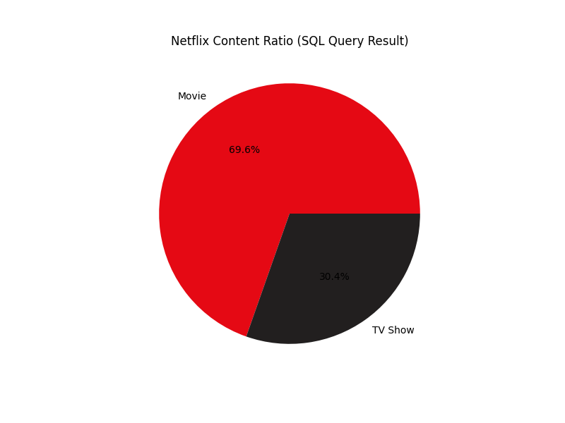
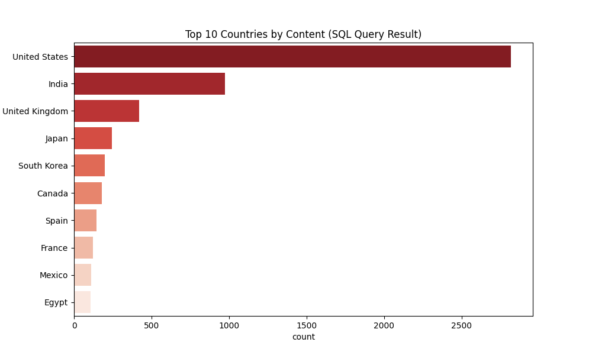

# Netflix Content Strategy & Data Analysis 🎬

## Project Overview
This project demonstrates a complete **Data Engineering & Analysis pipeline**. It automates the process of migrating raw data from a CSV file into a structured **SQLite Database** and performs advanced analytics using **Python** and **SQL**.

## Features
- **ETL Process:** Automated data extraction and loading using Python (Pandas & SQLite3).
- **SQL Analytics:** Complex queries to uncover content trends, top-producing countries, and release patterns.
- **Data Visualization:** High-quality charts generated with Matplotlib and Seaborn.

## Technologies Used
- [cite_start]**Languages:** Python, SQL 
- **Libraries:** Pandas, Matplotlib, Seaborn
- **Database:** SQLite
- **Tools:** VS Code, DB Browser for SQLite

## Key Visual Insights
### 1. Movie vs TV Show Ratio

### 2. Top 10 Countries by Content Production

## How to Run
1. Clone the repository.
2. Ensure Python is installed.
3. Run `pip install pandas matplotlib seaborn`.
4. Execute `python analysis.py` to regenerate the database and charts.

## Project Nature & Future Scope
This is a **Foundational Data Engineering project** designed to demonstrate the core cycle of Data Extraction, SQL Migration, and Visualization. 

**Current State:** * Static analysis of the Netflix dataset.
* Automated generation of key business metrics via SQL.

**Future Roadmap (Planned Improvements):**
* Integration with a live API for real-time data updates.
* Development of an interactive dashboard (using Streamlit or Flask).
* Advanced predictive analytics using Machine Learning models.
